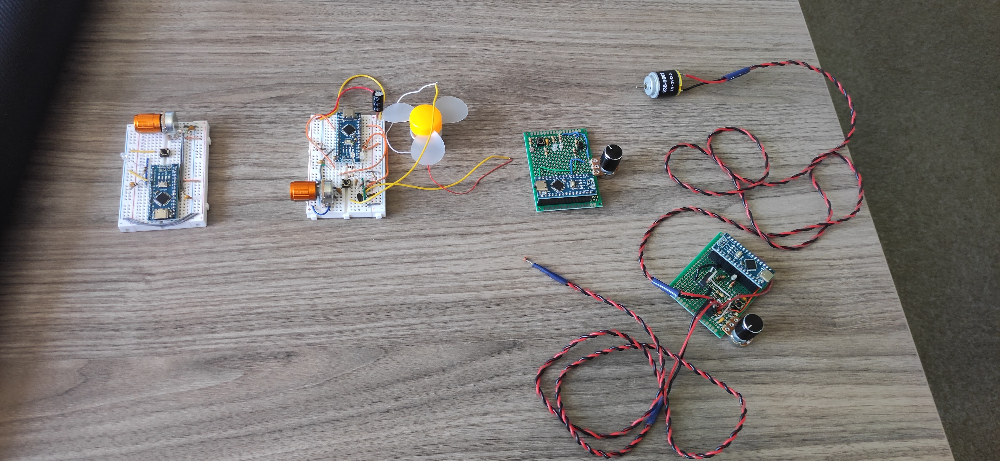

# Index
- [Index](#index)
- [Fan Control Demonstrator toy project](#fan-control-demonstrator-toy-project)
- [Features](#features)
- [Ideas to develop it further](#ideas-to-develop-it-further)

# Fan Control Demonstrator toy project
This little project was forked from [bebenlebricolo/NanoFridgeThermostat](https://github.com/bebenlebricolo/NanoFridgeThermostat) and implements a small fan controlling board.
It was born as a toy project to back up a course/hands-on workshop I gave, using some very light gear.

It's based on an Arduino Nano (using the "new" bootloader, for those we have available) and uses
* A NTC thermistor to measure the temperature
* A push button (small 4x6 switch) to cycle through various modes
* A potentiometer, to override automatic settings and provide user with a direct way of controlling output power
* A DC brushed motor working around 3V/1A
* All being powered via the USB port.

# Features
* Temperature controlled "Fan"
* Bypass functionality using the potentiometer

# Ideas to develop it further
* Add a "soft start" ramp-up to avoid short-circuiting USB power supply and give the motor time to start
* Add some filters on the raw data being read from the board
* Add custom behavior, like a curve that dictates the Fan's speed VS temperature (and the user can upload a new curve at will)

